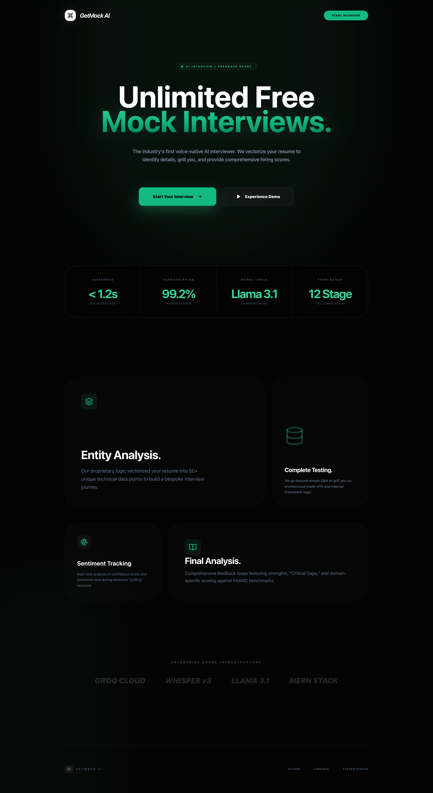
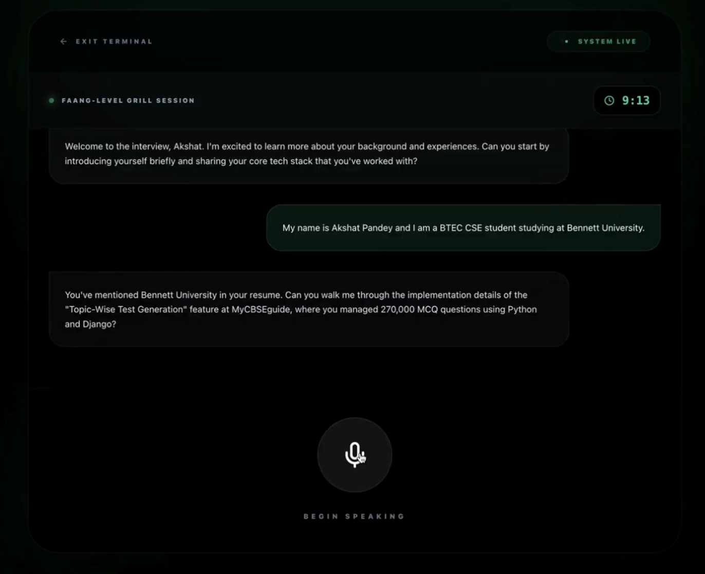
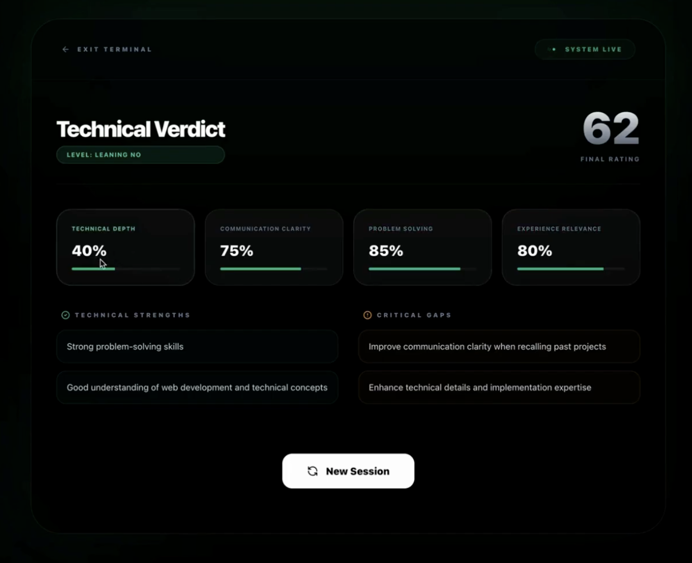

# GetMock AI
### Personalised AI Interviewer with Detailed Feedback

[](https://get-mock-ai.vercel.app/)
[](https://reactjs.org/)
[](https://nodejs.org/)
[](https://expressjs.org/)

**Context-Aware Interviewing · High-Fidelity Transcription · Automated Grading**  
*Built to simulate rigorous FAANG-level resume grilling using Llama 3.1 and Whisper v3.*

---

## Overview

**GetMock AI** is a sophisticated, full-stack platform designed to bridge the gap between candidate preparation and real-world technical interviews. By leveraging a Serverless Monorepo architecture, it provides a seamless end-to-end experience: from resume parsing to real-time voice-to-text interviewing and comprehensive performance analytics.

The platform focuses on **High-Stakes Simulation**:
- Dynamic Roadmap Generation
- Low-Latency Intelligence
- Zero-Persistence Logic

https://github.com/user-attachments/assets/6c2663e5-8524-4f2e-8783-4e0ff2826ade

---

## Interface Preview

### Landing Page


### Interview Window


### Feedback Report


---

## Core Features

- **Personalised Resume Deep-Dives**  
  Extracts text via pdf-parse to ask hyper-specific questions about your projects and experience.

- **95%+ Accurate Transcription**  
  High-fidelity speech-to-text processing using Whisper-large-v3.

- **Turn-Based Interview Logic**  
  Structured 12-turn roadmap covering Intro, Experience, Skills, Achievements, and System Design.

- **Automated Hiring Verdict**  
  Generates a "Google Hiring Committee" style JSON report with score metrics and specific areas for improvement.
  
---

## Engineering Decisions

### Vercel Serverless Functions over Always-On Servers
Chosen to eliminate "Cold Start" lag while maintaining a unified domain for frontend and API routes, reducing CORS complexity.

### ES Modules (ESM) Integration
Implemented "type": "module" throughout the project to ensure performance parity with modern browser standards and Vite's dev server.

### Groq Llama-3.1-8b-instant
Selected for its industry-leading token-per-second throughput, ensuring the AI interviewer feels responsive and conversational.

---

## Project Structure

```bash
GetMock-AI/
├── api/                  # Vercel Serverless Backend
│   └── index.js          # Groq, PDF, & Discord Logic (ESM)
├── src/                  # React Frontend
│   ├── components/       # UI Components (FileUpload, InterviewChat)
│   ├── App.jsx           # Main State Orchestrator
│   └── main.jsx          # React Entry Point
├── public/               # Static Assets
├── vercel.json           # Unified Routing Configuration
├── vite.config.js        # Frontend Proxy & Build Config
├── 1.png                 # Documentation Asset (Landing)
├── 2.png                 # Documentation Asset (Interview)
├── 3.png                 # Documentation Asset (Feedback)
├── package.json          # Root Dependencies (Type: Module)
└── README.md             # Documentation
```

---

## Getting Started

### Prerequisites
- Node.js **v18+**
- Groq Cloud API Key

---

### Installation

Clone the repository:
```bash
git clone https://github.com/AkshatPandey2006/GetMock-AI.git
cd GetMock-AI
```

Install dependencies:
```bash
npm install
```

### Run Locally

```bash
vercel dev
```

### API Reference

| End Point                | Method           | Payload                    | Description                            |
|--------------------------|------------------|----------------------------|----------------------------------------|
| /api/upload-resume       | Post             | `FormData (PDF)`           | Parses resume & pings Discord          |
| /api/transcribe          | Post             | `FormData (Audio)`         | Converts voice to text via Whisper v3s |
| /api/chat                | Post             | `{ history, resumeText }`  | Generates the next interview question  |
| /api/feedback            | Post             | `{ history, resumeText }`  | Generates final JSON evaluation        |

## Contributing

Contributions are welcome!

1. Fork the repository
2. Create a feature branch:
   ```bash
   git checkout -b feature/YourFeature
   ```
3. Commit your changes:
   ```bash
   git commit -m "Add YourFeature"
   ```
4. Push to the branch:
   ```bash
   git push origin feature/YourFeature
   ```
5. Open a Pull Request

## License

This project is licensed under the **MIT License**.  
See the [LICENSE](./LICENSE) file for details.

---

## Feedback

If you have any feedback, please reach out to me at akshat2006pandey@gmail.com

Built with ❤️ by **Akshat Pandey**  
🔗 LinkedIn: https://www.linkedin.com/in/akshatpandey2006
